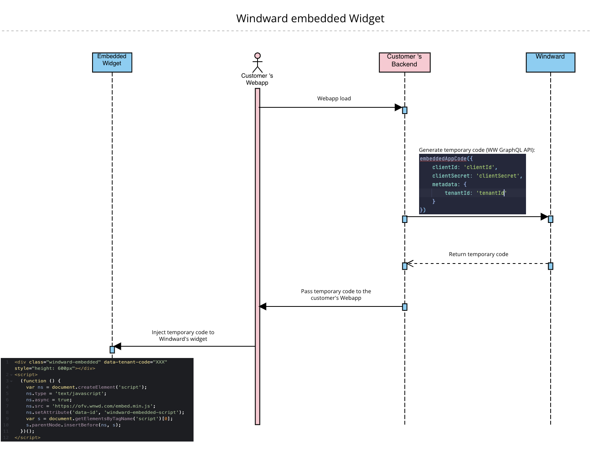

# Windward Embedded App

## Table of Contents

- [Getting Started](#getting-started)
- [Configuration](#configuration)
- [Usage](#usage)
- [Misc](#misc)

## Getting Started


1. Clone the repository:

   ```bash
   git clone git@github.com:windward-ltd/ww-embedded-app.git
   
2. Navigate to project directory:

   ```bash
   cd ww-embedded-app

3. Install the dependencies:

   ```bash
   npm install
   
4. Run the development server:

   ```bash
   npm run dev
   # or
   yarn dev
   # or
   pnpm dev
   ```

Open [http://localhost:3000](http://localhost:3000) with your browser to see the result.

You can start editing the page by modifying `pages/index.tsx`. The page auto-updates as you edit the file.

This project uses [`next/font`](https://nextjs.org/docs/basic-features/font-optimization) to automatically optimize and load Inter, a custom Google Font.


## Configuration
The project requires the following environment variables to be set. Use the provided .env file in the root directory and populate it with the necessary values:
```env
NEXT_PUBLIC_GRAPHQL_GATEWAY_URL=https://graphql.wnwd.com
NEXT_PUBLIC_EMBEDDED_APP_SCRIPT_ORIGIN=https://ofv.wnwd.com
EMBEDDED_APP_SCRIPT_CLIENT_ID=<clientId>
EMBEDDED_APP_SCRIPT_CLIENT_SECRET=<clientSecret>
```

Please note that the environment variables defined with the `NEXT_PUBLIC_` prefix are exposed to the browser.
As explained [here](https://nextjs.org/docs/pages/building-your-application/configuring/environment-variables#exposing-environment-variables-to-the-browser).

## Usage

Windward's GraphQL API expects to receive the following variables in order to return a valid code:
```js
embeddedAppCode({
   clientId: 'clientId', // mandatory
   clientSecret: 'clientSecret', // mandatory
   metadata: {
       tenantId: 'tenantId' // mandatory
   }
})
```

Please note, passing a `tenantId` is required in order to show only the specific tenant shipments.

---

As shown in the above diagram, the received code from our API needs to be injected to our widget with the `data-tenant-code` attribute shown below.

This repo gives an example of how to embed our app using NextJS.
However, should you choose another technology we have provided the following HTML that is needed in your code in order to load our app:

```html
<div class="windward-embedded" data-tenant-code="<tenant-code>" style="height: 600px"></div>
<script>
  (function () {
    var ns = document.createElement('script');
    ns.type = 'text/javascript';
    ns.async = true;
    ns.src = `${process.env.NEXT_PUBLIC_EMBEDDED_APP_SCRIPT_ORIGIN}/embed.min.js`;
    ns.setAttribute('data-id', 'windward-embedded-script');
    var s = document.getElementsByTagName('script')[0];
    s.parentNode.insertBefore(ns, s);
  })();
</script>
```
`data-tenant-code` denotes the specific tenant code that indicates which shipments will be shown to the user.

After inserting our widget to your codebase and providing it the code from our API you should be able to see our app embedded inside yours.


## Misc

Node.js version used: 16.19.0

For any further questions or inquiries, please contact Windward.
